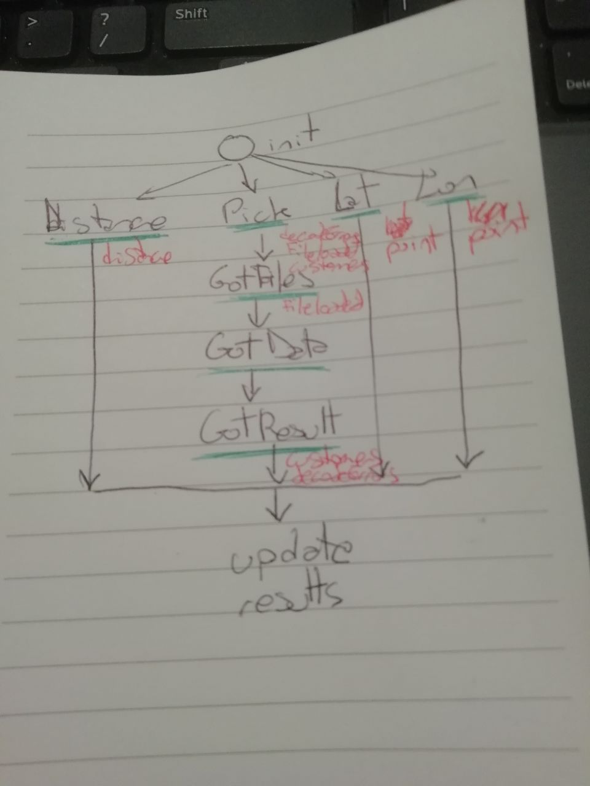

# Find customers within a specific radius

### The problem:
We want to invite any customer within 100km of our Dublin office for some food and drinks on us.

### Input:
 a text file (customers.txt) -- one customer per line, JSON lines formatted.

### Output 
 A text file with names and user ids of customers within 100km, sorted by user ids ascending.

An output generated with the default settings is [output.txt](./output.txt)

## Action loop
In the graph there is the abstract state machine.
As Elm uses reactive programming any changes from init are user actions that trigger an update of the view.
In Green the states the application can be in
In Red the model (what in React is the internal state) changes



## How to run this code
 Download and install Elm from https://guide.elm-lang.org/install/elm.html

### From a browser (production code)
From the main project folder run 

```elm make src/Main.elm```

It will create a index.html file follow the instructions under the Embedding header to add the Bootstrap CSS http://elm-bootstrap.info/getting-started

You can move the file and deploy it on a static webserver

*Note:* a compiled [index.html](./index.html) is found in the main folder

### From a browser (development environment)
From the main project folder run 
```elm reactor```

Open your browser at http://localhost:8000/src/Main.elm

## Run unit tests
Using Elm prevents developer errors because it won't compile if typings are not respected.
Because of this, there is less need of writing tests as Elm itself will prevent runtime exceptions.

To install the test library run from the main project folder
```npm install -g elm-test```

To run the tests use
```elm-test init```